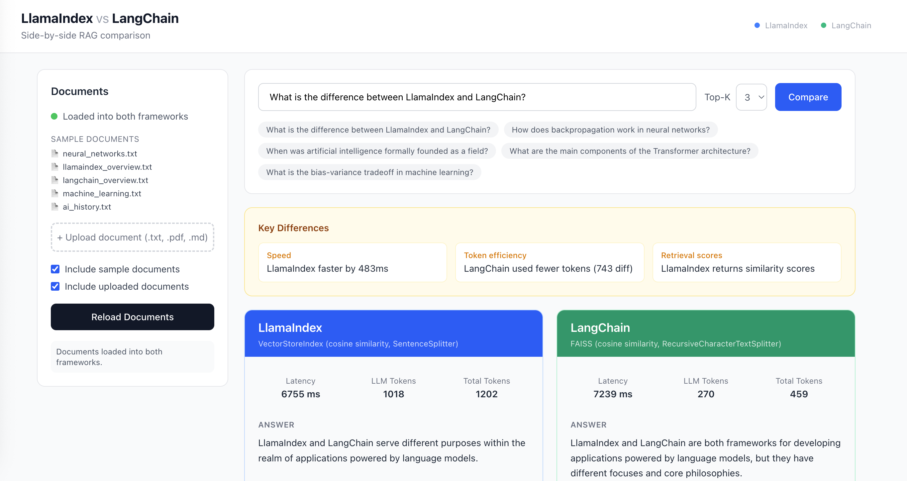

# LlamaIndex vs LangChain — RAG Comparison

A side-by-side RAG (Retrieval-Augmented Generation) playground that runs the same query through both **LlamaIndex** and **LangChain** simultaneously and displays the results for direct comparison.



## What it does

- Upload your own documents (`.txt`, `.pdf`, `.md`) or use the included sample docs on AI/ML topics
- Ask any natural-language question
- Both frameworks answer in parallel using the same model (`gpt-4o-mini`) and embedding model (`text-embedding-3-small`)
- Results are shown side-by-side with answer text, retrieved source chunks, latency, and token usage

## Tech stack

| Layer | Technology |
|---|---|
| Backend | FastAPI (Python) |
| RAG — LlamaIndex | `llama-index-core`, `VectorStoreIndex`, `SentenceSplitter` |
| RAG — LangChain | `langchain`, FAISS vector store, `RecursiveCharacterTextSplitter`, `RetrievalQA` |
| LLM | OpenAI `gpt-4o-mini` |
| Embeddings | OpenAI `text-embedding-3-small` |
| Frontend | React 19 + TypeScript + Vite + Tailwind CSS |

## Project structure

```
.
├── backend/
│   ├── main.py              # FastAPI app + REST endpoints
│   ├── llamaindex_rag.py    # LlamaIndex RAG implementation
│   ├── langchain_rag.py     # LangChain RAG implementation
│   ├── sample_docs/         # Sample .txt files on AI/ML topics
│   ├── uploads/             # User-uploaded documents (auto-created)
│   └── requirements.txt
├── frontend/
│   ├── src/
│   │   ├── App.tsx          # Root component
│   │   ├── api.ts           # API client
│   │   └── types.ts         # Shared TypeScript types
│   └── package.json
├── .env.example
└── start.sh                 # One-command startup script
```

## Prerequisites

- Python 3.11+
- Node.js 18+
- An OpenAI API key

## Setup

**1. Clone and configure environment**

```bash
cp .env.example backend/.env
# Edit backend/.env and set your OPENAI_API_KEY
```

**2. Install backend dependencies**

```bash
cd backend
python -m venv .venv
source .venv/bin/activate      # Windows: .venv\Scripts\activate
pip install -r requirements.txt
```

**3. Install frontend dependencies**

```bash
cd frontend
npm install
```

## Running the app

From the project root, run both servers with a single command:

```bash
./start.sh
```

Or start them separately:

```bash
# Terminal 1 — backend
cd backend && .venv/bin/uvicorn main:app --reload --port 8000

# Terminal 2 — frontend
cd frontend && npm run dev
```

Then open [http://localhost:5173](http://localhost:5173).

## API endpoints

| Method | Path | Description |
|---|---|---|
| `GET` | `/health` | Health check |
| `GET` | `/api/documents` | List available and loaded documents |
| `POST` | `/api/upload` | Upload a document (`.txt`, `.pdf`, `.md`) |
| `POST` | `/api/load` | Index documents into both frameworks |
| `POST` | `/api/query` | Run a question through both frameworks |

### Query request/response

```json
// POST /api/query
{ "question": "What is RAG?", "top_k": 3 }

// Response
{
  "question": "What is RAG?",
  "llamaindex": {
    "answer": "...",
    "retrieved_nodes": [{ "text": "...", "score": 0.87, "source": "file.txt" }],
    "latency_ms": 1240.5,
    "tokens": { "prompt": 512, "completion": 128, "embedding": 64, "total": 704 },
    "framework": "LlamaIndex",
    "retrieval_strategy": "VectorStoreIndex (cosine similarity, SentenceSplitter)"
  },
  "langchain": { "..." }
}
```

## How the two implementations compare

| | LlamaIndex | LangChain |
|---|---|---|
| Vector store | In-memory `VectorStoreIndex` | FAISS |
| Text splitter | `SentenceSplitter` (512 / 64 overlap) | `RecursiveCharacterTextSplitter` (512 / 64 overlap) |
| Query chain | `VectorStoreIndex.as_query_engine` | `RetrievalQA` (stuff chain) |
| Similarity scores | Yes (cosine) | No (FAISS `similarity_search` default) |
| Token tracking | `TokenCountingHandler` | `get_openai_callback` |
